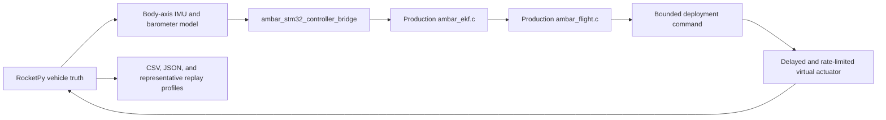

# Software Architecture

## Design Goal

The production STM32 flight modules are the source of truth for the main
closed-loop simulation. RocketPy and the Monte Carlo campaign compile the same
`ambar_ekf.c` and `ambar_flight.c` files used by the CubeIDE firmware. The older
C++ `AmbarFlightComputer` remains useful for fast native regression sandboxes,
but it is not used to claim production-controller trajectory results.

## Production Closed-Loop Data Flow

RocketPy owns atmosphere, motor mass change, six-degree-of-freedom vehicle
motion, provisional sensors, and virtual actuator motion. The C bridge owns
persistent production estimator/phase/controller state. A deployment command
therefore changes the next RocketPy trajectory sample.

The firmware currently consumes one configured, pad-referenced body-axis
accelerometer channel without attitude rotation. The simulation mirrors that
contract by projecting RocketPy acceleration into the rocket body axis before
adding sensor errors. It does not yet reproduce vibration, mounting error, raw
register behavior, or the complete STM32 scheduler.

## Production Firmware Modules

| File | Responsibility |
| --- | --- |
| `firmware/stm32_airbrake_pcb/Core/Src/ambar_ekf.c` | Vertical estimator and health state |
| `firmware/stm32_airbrake_pcb/Core/Src/ambar_flight.c` | Flight phases, drag-aware/ballistic apogee estimates, and airbrake command |
| `firmware/stm32_airbrake_pcb/Core/Src/ambar_app.c` | Runtime configuration, scheduling, USB commands, logging, and subsystem integration |
| `sim/stm32_controller_bridge.c` | Small host adapter around the production EKF/flight modules |
| `sim/rocketpy/run_rocketpy_sim.py` | One paired passive/controlled physics study |
| `sim/rocketpy/run_monte_carlo.py` | Repeated baseline and seeded Latin-hypercube campaign |

The host bridge starts from compiled `AmbarFlight_DefaultConfig()` values and
applies the fixed controller fields recorded in
`sim/rocketpy/ambar_reference_config.json`. A board can load a different saved
configuration from flash, so board configuration readback must be compared
before treating software-in-the-loop and hardware behavior as equivalent.

## Legacy Native C++ Sandboxes

`include/ambar_airbrake.hpp` and `src/ambar_airbrake.cpp` implement an older
portable C++ model. These fast executables remain regression and teaching tools:

- `sim_flight_sandbox.exe`
- `sim_electronics_sandbox.exe`
- `sim_actuator_sandbox.exe`
- `sim_fault_replay_sandbox.exe`
- `sim_monte_carlo_sandbox.exe`
- `ambar_core_tests.exe`
- `ambar_controller_bridge.exe`

They do not replace the production STM32-C bridge. In particular, the legacy
200-case Monte Carlo executable uses simplified 1-D physics and hard-coded
distributions.

## Monte Carlo Evidence Bundle

`scripts/run_monte_carlo.ps1` always rebuilds the production-C bridge, resolves
all trial inputs before run 1, and writes `parameters.csv`, a running manifest,
and input snapshots up front. `runs.csv` is replaced atomically after every
attempt so an interrupted campaign retains completed evidence. Final output
adds aggregate metrics, sensitivity ranks, representative time histories, and
OpenRocket-compatible profiles for selected USB/HIL replays.

The randomized plant/sensor/actuator truth is deliberately separate from the
fixed controller configuration. This prevents the controller from receiving
the randomized motor burn time, mass, drag, or sensor errors as foreknowledge.

## Simulation Console

The browser UI is a thin launcher and report viewer:

- `scripts/run_simulation_ui.ps1` starts the local server.
- `scripts/simulation_ui_server.py` validates temporary trade-study inputs.
- `ui/app.js` displays results from native executables and
  `build/rocketpy-last-run.json`.

The UI quick `Run All` path excludes the longer production Monte Carlo
campaign. Run that campaign from `Run Monte Carlo Simulation.cmd` or its
PowerShell script.

## Which Entry Point To Use

- Use `scripts/run_sandboxes.ps1` for fast legacy native regressions.
- Use `scripts/run_rocketpy_sim.ps1` for one production-controller trajectory.
- Use `scripts/run_monte_carlo.ps1` for repeated robustness screening and CSVs.
- Use `scripts/run_simulation_ui.ps1` to inspect the one-run and native results.
- Use the tools under `firmware/stm32_airbrake_pcb/tools/usb_protocol` for
  selected STM32 USB/HIL replays.
- Use the CubeIDE project under `firmware/stm32_airbrake_pcb` for the board
  firmware build and flash workflow.
