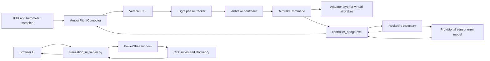

# Software Architecture

## Design Goal

The project keeps flight decisions in one reusable C++ core. Desktop demos,
test sandboxes, RocketPy, and future STM32 firmware should all call the same
`AmbarFlightComputer` interface. This prevents a simulation-only controller
from drifting away from the code intended for the vehicle.

## Data Flow

## Shared Flight Logic

| File | Responsibility | Used By |
| --- | --- | --- |
| `include/ambar_airbrake.hpp` | Public estimator, phase, controller, command, and facade interfaces | Desktop demo, flight sandbox, RocketPy bridge, future firmware |
| `src/ambar_airbrake.cpp` | Platform-independent implementation of those interfaces | Linked into every target that needs real flight logic |
| `include/ambar_project_requirements.hpp` | M5 mission limits and targets | Electronics and actuator checks, future requirement tests |
| `include/ambar_board_pins.hpp` | V3 MCU pin naming | Compile-time checks and future STM32 board support |
| `include/ambar_device_constants.hpp` | Datasheet addresses, IDs, bus modes, and limits | Electronics checks and future hardware drivers |

The core accepts launch-frame vertical acceleration and barometric altitude
above the pad. Raw sensor register reads, axis rotation, gravity removal, motor
steps, and radio packets belong outside this layer.

## Native Executables

| Target | Use Case | Important Limitation |
| --- | --- | --- |
| `rocket_airbrake_ekf.exe` | Small API example and smoke test | Uses toy motion, not reference rocket physics |
| `sim_flight_sandbox.exe` | Fast repeatable estimator/controller fault tests | Simplified one-dimensional flight model |
| `sim_electronics_sandbox.exe` | Review startup ARMABLE/BLOCKED policy | Does not emulate real I2C/SPI transactions |
| `sim_actuator_sandbox.exe` | Review homing, rate, inhibit, and jam behavior | Not a TMC5240 driver or final mechanism model |
| `sim_fault_replay_sandbox.exe` | Review timestamp/sensor fault policy and deterministic replay | Synthetic log; no real driver freshness data |
| `sim_monte_carlo_sandbox.exe` | Fixed-seed software safety dispersion | Provisional 1-D distributions; not mission probability |
| `ambar_core_tests.exe` | Focused assertions for public flight-core behavior | Does not exercise hardware drivers |
| `ambar_controller_bridge.exe` | Preserve C++ controller state while RocketPy runs | Machine protocol only; not intended for direct use |

`CMakeLists.txt` defines the same target graph for CMake users.
`scripts/run_sandboxes.ps1` provides the proven direct-compiler path on Windows.

## RocketPy Closed Loop

`scripts/run_rocketpy_sim.ps1` builds the controller bridge and launches
`sim/rocketpy/run_rocketpy_sim.py`. RocketPy owns atmosphere, motor mass change,
aerodynamics, and trajectory integration. At each controller sample:

1. RocketPy supplies trajectory truth and applies configured wind.
2. The Python sensor adapter adds deterministic provisional bias, noise,
   quantization, saturation, and latency.
3. The Python process sends a `STEP` message to `ambar_controller_bridge.exe`.
4. The bridge calls the real C++ `AmbarFlightComputer` instance.
5. The bridge returns estimate, phase, health, and deployment command.
6. RocketPy rate-limits that command and applies it to its virtual airbrakes.

Vehicle inputs live in `sim/rocketpy/ambar_reference_config.json`; motor thrust
lives in `sim/rocketpy/j420r.eng`. Detailed run data is written to
`build/rocketpy-last-run.json`.

## Simulation Console

The browser layer is deliberately thin:

- `scripts/run_simulation_ui.ps1` starts the local server.
- `scripts/simulation_ui_server.py` serves `ui/` and dispatches run requests.
- The server attaches `build/rocketpy-last-run.json` to RocketPy responses so
  the browser can plot the validated sample log without scraping terminal text.
- `ui/index.html` defines the static page structure.
- `ui/styles.css` controls presentation only.
- `ui/app.js` requests runs, parses suite output, and renders results.

The UI does not contain alternate pass/fail physics or control behavior. Its
source of truth is the output of the executable suites.

## Which Entry Point To Use

- Use `scripts/run_all_simulations.ps1` before reviews or commits.
- Use `scripts/run_sandboxes.ps1` for quick C++ logic and fault checks.
- Use `scripts/run_rocketpy_sim.ps1` for trajectory and apogee studies.
- Use `scripts/run_simulation_ui.ps1` when reviewing results visually.
- Use `src/main.cpp` when learning the `AmbarFlightComputer` API.
- Use `ctest --test-dir build --output-on-failure` for the native automated
  verification set after a CMake build.
- Start future embedded integration with `include/ambar_airbrake.hpp`, then add
  board drivers and scheduling around it rather than modifying simulation code.
